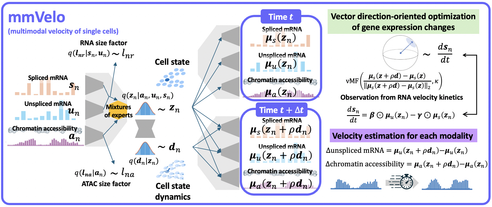

# mmVelo
mmVelo is a deep generative model designed to estimate cell state-dependent dynamics across multiple modalities. By utilizing splicing kinetics and multimodal representation learning, mmVelo infers cell state dynamics on joint representations and estimates temporal changes in specific modalities by mapping these dynamics.

## Usage
A detailed tutorial on running mmVelo can be found [here (tutorial.ipynb)](https://github.com/nomuhyooon/mmVelo/blob/master/tutorial.ipynb).

To apply mmVelo to a custom dataset, follow these steps:
1.  Prepare AnnData for each modality:
- RNA modality:
    - Use `AnnData` to store spliced and unspliced mRNA counts.
    - Save the spliced mRNA counts in `AnnData.layers["spliced"]` and the unspliced mRNA counts in `AnnData.layers["unspliced"]` as sparse matrices (cell x gene).

- ATAC (or other) modality:
    - Use `AnnData.X` to store chromatin accessibility data as a sparse matrix (cell x peak).
    - Save the prepared ATAC AnnData as `./data/adata_atac.loom`.

2. Run the training script:
    Execute `train.py` to start the training process. Make sure to set the `--custom_data` argument to `True` using the argument parser.

For more information on the methods, refer to our preprint.